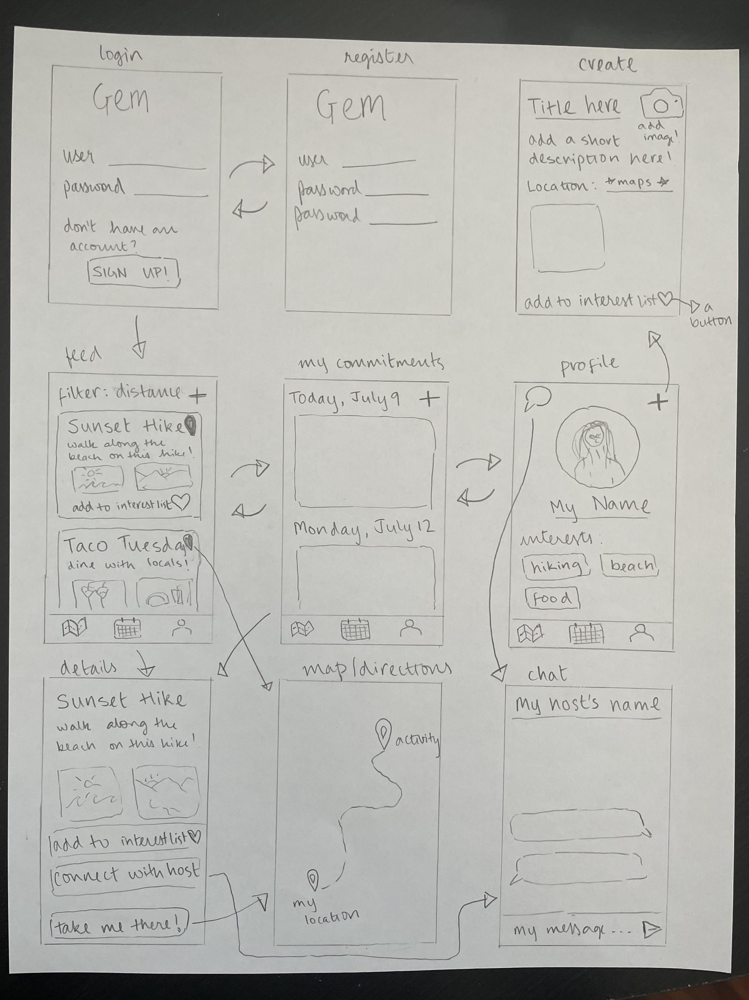

# Gem

## Table of Contents
1. [Overview](#Overview)
1. [Product Spec](#Product-Spec)
1. [Wireframes](#Wireframes)
2. [Schema](#Schema)

## Overview
### Description
A travel app to discover hidden gems--destinations, eats, and experiences unique to locations, but often not found on your typical top 10 attractions lists. Curated by locals, Gem is a way to travel authentically--seeing, living, and embracing the culture of a destination as if you were part of the community itself.

To view my project plan and stay updated on my progress, check out this [Notion](https://www.notion.so/gem-4475f976cb8e46f5bfdcfed954a1472b)!

### App Evaluation
- **Category:** Travel
- **Mobile:** Mobile first experience--travelers often have easier access to their phones/an app than a website. Mobile allows for on-the-go exploration.
- **Story:** Allows travelers to discover hidden gems at destinations and have authentic experiences by connecting to local guides, who can host experiences and share their culture.
- **Market:** Anyone traveling who is interested in a more authentic travel experience as opposed to a touristy trip. Any locals interested in sharing their culture, potentially for compensation.
- **Habit:** Travelers would use this on a daily basis when planning their trips, locals would use this as a side-hustle
- **Scope:** Gem would start out by allowing locals to post experiences/trips, and allowing travelers to view, filter based on category and location, and match with said experiences/trips. It could expand to allow travelers to chat with locals, and even get notifications for nearby activities when posted.

## Product Spec

### 1. User Stories (Required and Optional)

**Required Must-have Stories**

- [x] Users can log in/log out of the app
- [x] Users can create a new account
- [x] Locals can post new experiences
  - [ ] Each post allows for a title, description, location, contact info, and images
- [x] Users can scroll through experiences (feed)
  - [x] Users can view a details page about each experience
  - [ ] Users can get directions to the location of an experience
- [ ] Users can favorite experiences to be placed on an interest list (double-tap)
- [x] Users can view a 'my commitments' page with experiences they have favorited

**Optional Nice-to-have Stories**

- [ ] Users can filter experiences based on category
- [ ] Users can view profile page
- [ ] Users can leave reviews on experiences
- [ ] Users can un-favorite posts
- [ ] Users can delete their posts
- [ ] Travelers can chat with locals
- [ ] Users get notifications for nearby activities (OR, users get notifications before activities they marked as interested)

### 2. Screen Archetypes

* Login
   * User can login
* Registration
   * User can create new account
* Feed
   * User can view a feed of experiences, filter through experiences
   * User can double tap on an experience to add it to their interest list
* Creation
   * User can post a new experience to their feed
* Details
   * User can view details about each experience
* Commitments
   * User can view all experiences that they have favorited

Optional:
* Chat
   * User can chat with other users (usually travelers --> locals)
* Profile
   * User can view their profile, set profile pic, select preferences

### 3. Navigation

**Tab Navigation** (Tab to Screen)

* Feed
* Commitments
* Create
* Profile

**Flow Navigation** (Screen to Screen)

* Login --> Home/Feed
* Registration --> Home/Feed
* Create --> Feed
* Feed --> Details

## Wireframes

## Schema
### Models
#### Experience
| Property     | Type            | Description                                 |
|--------------|-----------------|---------------------------------------------|
| objectID     | String          | unique id for the user post (default field) |
| author       | pointer to User | post author                                 |
| createdAt    | DateTime        | date when post is created (default field)   |
| title        | String          | title of event                              |
| image        | File            | image that user posts                       |
| description  | String          | event description by the author             |
| location     | String          | location of event by author                 |

#### User
| Property     | Type   | Description                                 |
|--------------|--------|---------------------------------------------|
| objectID     | String | unique id for the user post (default field) |
| username     | String | username for user, set at account creation  |
| password     | String | password for user, set at account creation  |
| profileImage | File   | profile photo for user                      |
| passions     | Array  | list of all selected passions (optional)    |

#### Commitments
join table for users - experiences (to keep track of commitments)
| Property     | Type                  | Description                  |
|--------------|-----------------------|------------------------------|
| user         | pointer to User       | unique id for the user       |
| experience   | pointer to Experience | unique id for the experience |

### Networking
- [Add list of network requests by screen ]
- [Create basic snippets for each Parse network request]
- [OPTIONAL: List endpoints if using existing API such as Yelp]
